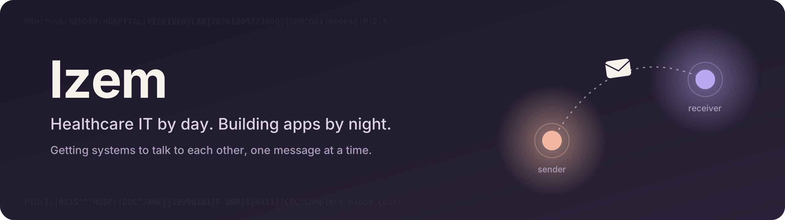

### Hi, I'm Izem.

I work in healthcare IT, where my job is mostly making sure a message leaves one hospital system and actually arrives at the other. It gave me a deep respect for software that quietly does its job.

After hours I build apps, usually for someone close to me or because I couldn't stop thinking about an idea. I care about how things feel as much as how they work, and I'm turning this habit into a path toward development, one project at a time.

### Things I've built

| | |
|---|---|
| **Mezem** | An app for people who love each other from different cities. Started as a gift, grew into a web and mobile app in three languages. |
| **UsageBar** | A macOS menu bar app that answers the question: where did all my AI usage go? |
| **Patient management** | A small app split into frontend, API and database containers. Built to finally understand Docker properly. |
| **Tweet pipeline** | Turns my notes into post drafts and waits for my okay before anything goes out. |

All private for now. Happy to show them if you ask.

### What I build with

  

### Find me

[LinkedIn](https://www.linkedin.com/in/YOUR-PROFILE)
